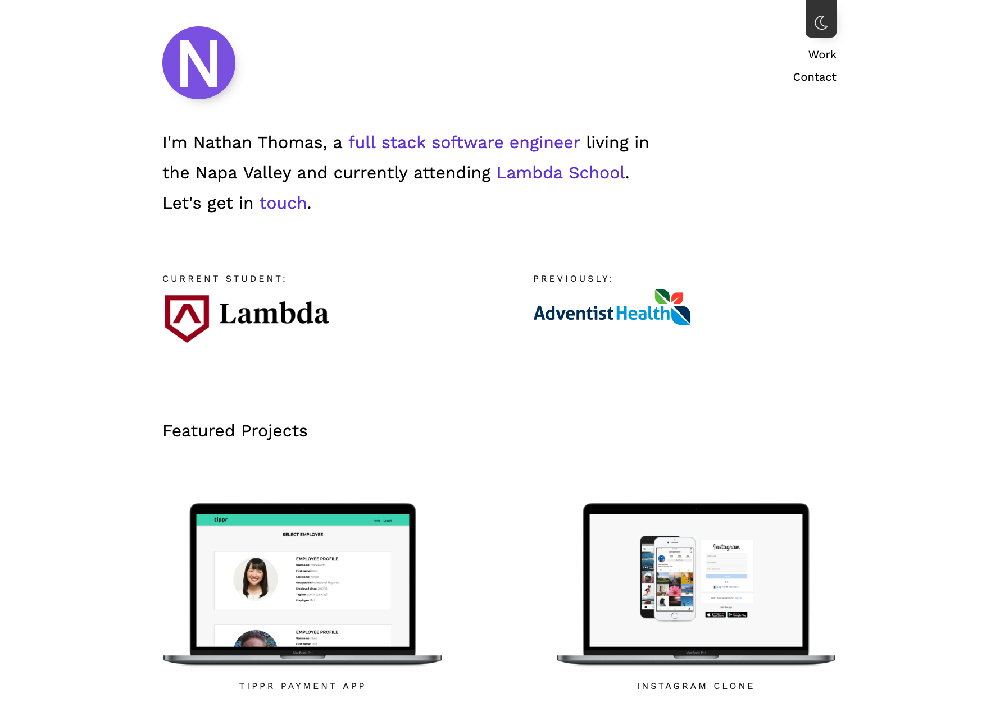

<h1 align="center"></h1>

# Personal Portfolio Website

A personal portfolio is meant to be a personal touch in the otherwise routine process of a job search. It's a chance for a candidate to put emphasis on their journey, their personality, and to highlight pieces of work that are important to them.

In that respect, my portfolio follows what I'm passionate about in life; I like clean design, and minimalism has always appealed to me. It is because of these passions that I've developed a stylish-yet-minimal personal portfolio utilizing cutting-edge technology such as React Hooks (used in this portfolio during its alpha state and now in full release).
 

 

## Getting Started

- Fork or directly clone this repository to your local machine
- `cd` into the root directory of the project and use the `yarn` command to install client-side dependencies including:
  - `React`
  - `React Router`
  - `React Hooks`
  - `Styled Components`
- `cd` into the `server` file directory and use the command `yarn` to install server-side dependencies including:
  - `Express`
  - `Axios`
  - `NodeMailer`
- Once the dependencies are finished installing, use the `yarn start` command inside both the server and the client directories to open the portfolio app in your local browser of choice

## Built With

- [React](https://reactjs.org/)
- [React Router](https://github.com/ReactTraining/react-router)
- [React Hooks](https://reactjs.org/docs/hooks-intro.html)
- [Styled Components](https://www.styled-components.com/)
- [Axios](https://www.npmjs.com/package/axios)
- [Express](https://expressjs.com/)
- [NodeMailer](https://nodemailer.com/about/)
- [CORS](https://github.com/expressjs/cors)

## Author

- [Nathan Thomas](https://github.com/nwthomas)

## Acknowledgements

- Thanks to [Daniel Destefanis](http://danielrd.com/) for the layout inspiration.
