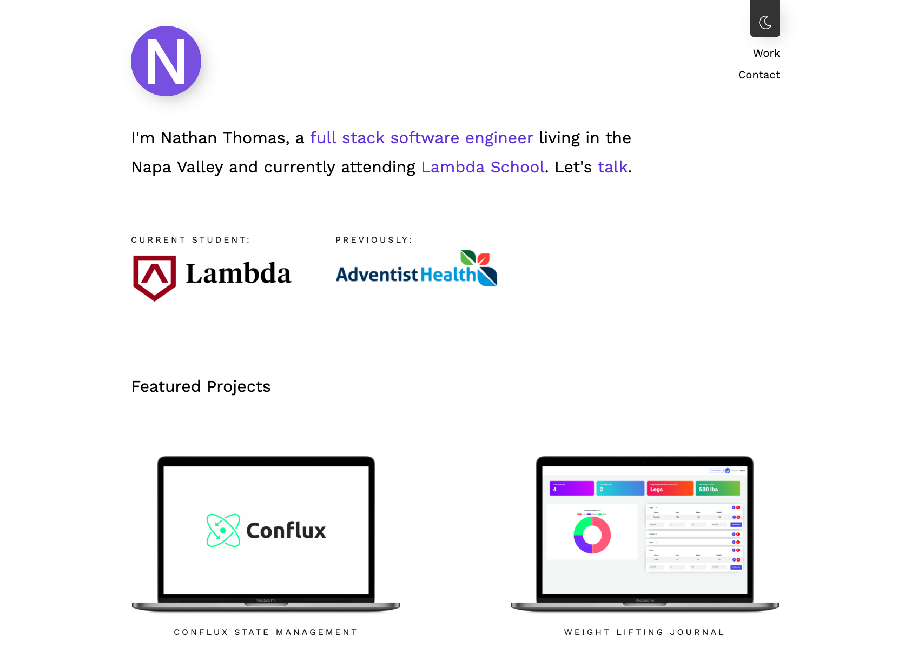

#

<h1 align="center"></h1>

# Personal Portfolio Website

A personal portfolio is meant to be a personal touch in the otherwise routine process of a job search. It's a chance for a candidate to put emphasis on their journey, their personality, and to highlight pieces of work that are important to them.

In that respect, my portfolio follows what I'm passionate about in life; I like clean design, and minimalism has always appealed to me. It is because of these passions that I've developed a stylish-yet-minimal personal portfolio utilizing cutting-edge technology such as React Hooks (used in this portfolio during its alpha state and now in full release).
 

 

## Table of Conents

- [Getting Started](#getting-started)
- [Stack](#stack)
- [Unit Testing](#unit-testing)
- [Project Management](#project-management)
- [Author](#author)
- [Acknowledgements](#acknowledgements)

## Getting Started

- Fork or directly clone this repository to your local machine
- `cd` into the `client` directory of the project and use the `yarn` command to install client-side dependencies including:
  - `React`
  - `React Router`
  - `React-Conflux`
  - `Styled Components`
  - `Axios`
  - `Email Validator`
  - `Jest-DOM`
  - `React-Test-Renderer`
  - `React-Testing-Library`
- `cd` into the `server` file directory and use the `yarn` command to install server-side dependencies including:
  - `Express`
  - `NodeMailer`
  - `Helmet`
  - `Morgan`
  - `CORS`
  - `DOTENV`
- Once the dependencies are finished installing, use the `yarn start` command inside both the server and the client directories to open the portfolio app in your local browser of choice

## Stack

- [React](https://reactjs.org/)
- [React Router](https://github.com/ReactTraining/react-router)
- [React Conflux](https://github.com/dustinmyers/react-conflux)
- [Styled Components](https://www.styled-components.com/)
- [Axios](https://www.npmjs.com/package/axios)
- [Email Validator](https://www.npmjs.com/package/email-validator)
- [Express](https://expressjs.com/)
- [NodeMailer](https://nodemailer.com/about/)
- [CORS](https://github.com/expressjs/cors)
- [Helmet](https://helmetjs.github.io/)
- [Morgan](https://www.npmjs.com/package/morgan)

## Unit Testing

- `cd` into the `client` directory
- Ensure that all appropriate dependencies for testing are installed by running `yarn` to install them
- Run the `yarn test` command to run the testing suites

## Project Management

- Check out the [Trello Board](https://trello.com/b/AnRRw8EN/nathan-thomas-personal-portfolio) for this project to see what tasks have been completed so far and what still needs to be done

## Author

- [Nathan Thomas](https://github.com/nwthomas)

## Acknowledgements

- Thanks to [Daniel Destefanis](http://danielrd.com/) for the layout inspiration.
- _Huge_ thanks to the career counselors at [Lambda School](https://lambdaschool.com/) for never turning me away all during any of the many, many, many times I dropped by your digital office asking for advice.
